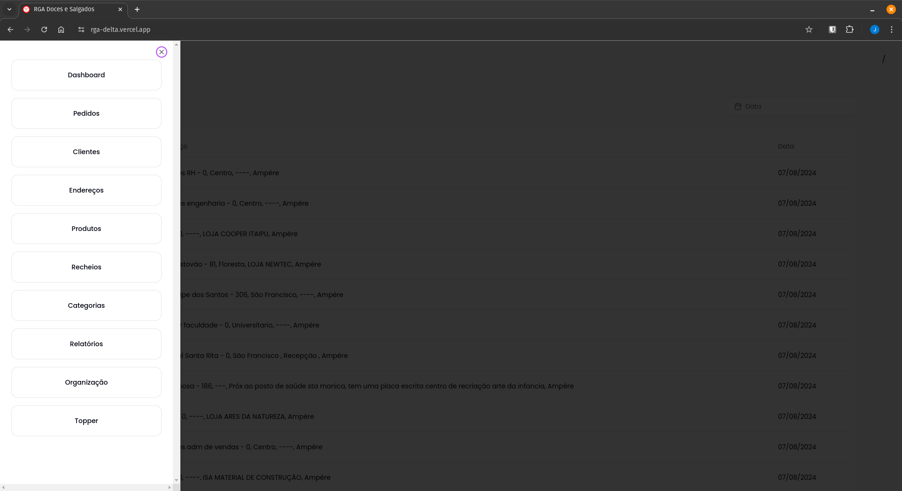
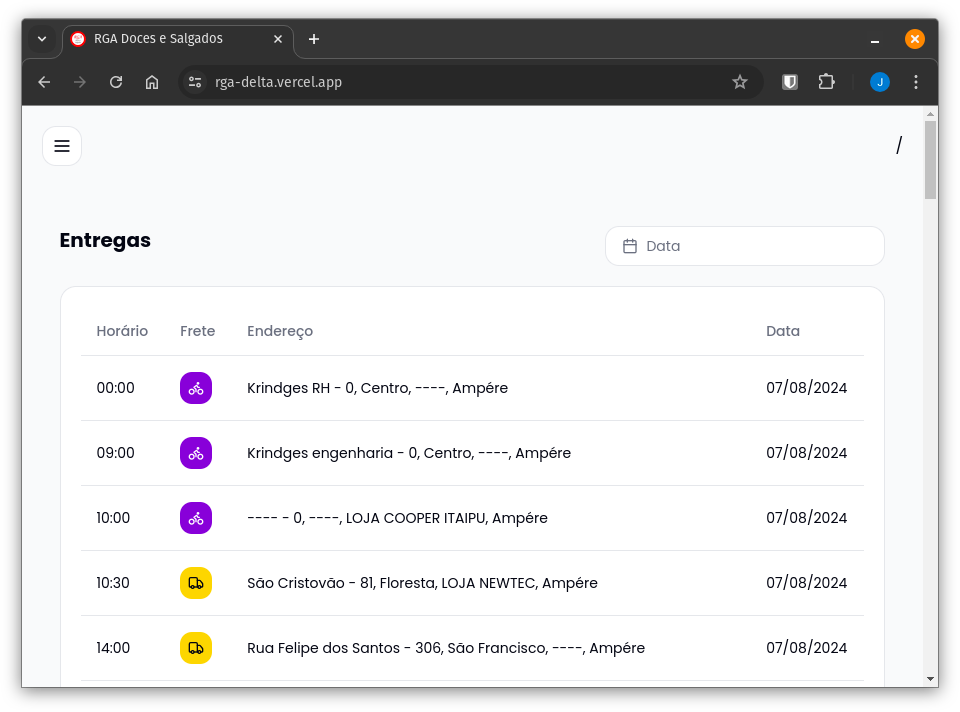
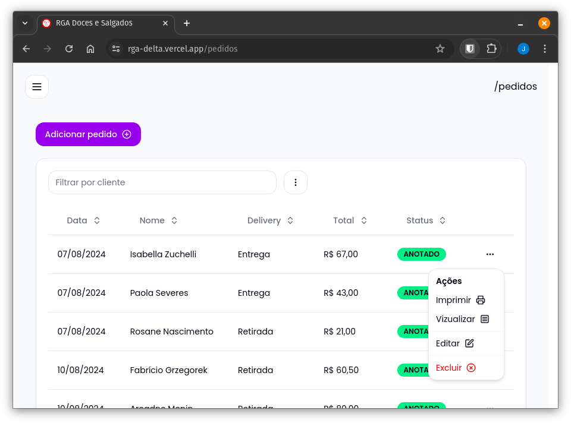
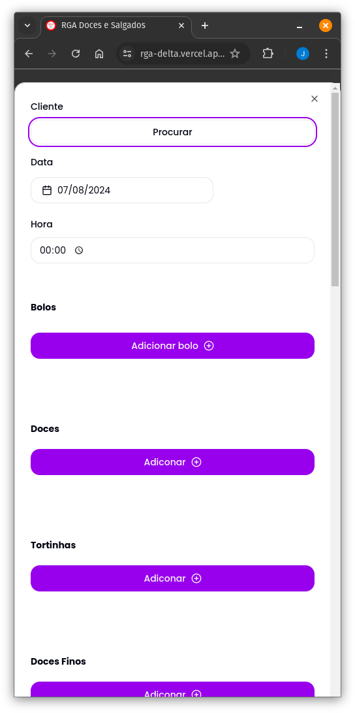
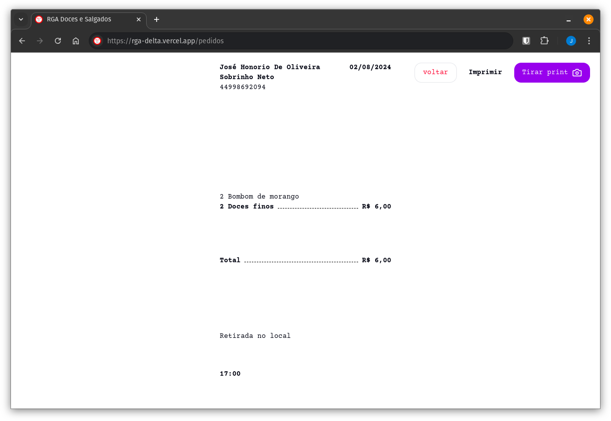
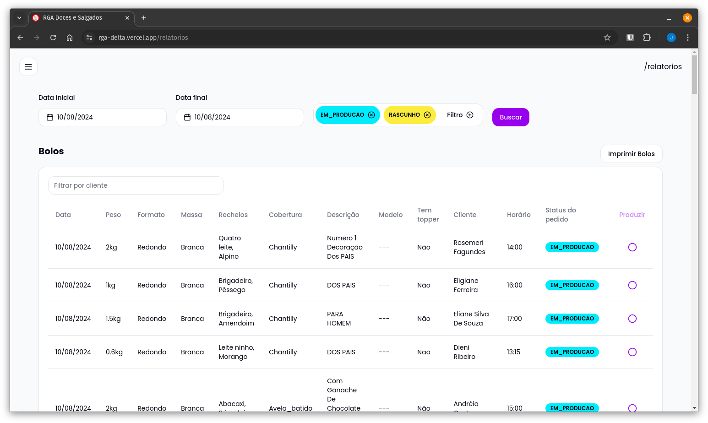
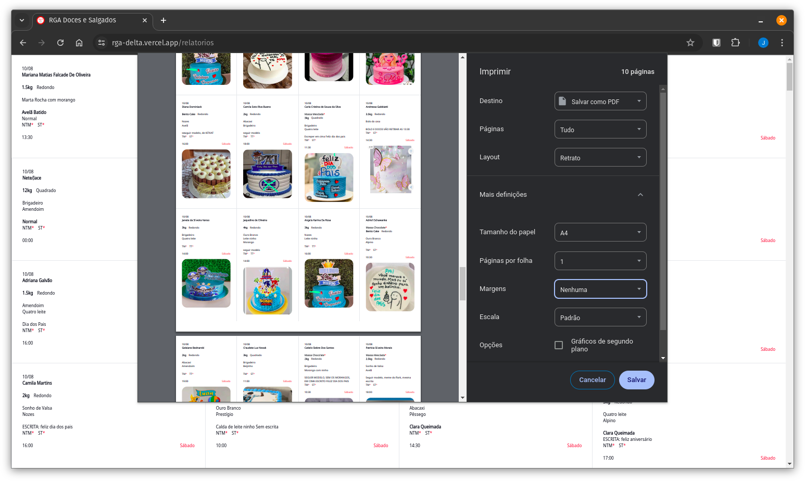

# Introdução

A RGA Doces e Salgados, apesar de ser uma empresa jovem com apenas 5 anos de mercado, conquistou um crescimento exponencial e uma enorme carteira de clientes. Quando iniciei na empresa, todos os processos, desde a gestão de pedidos até a organização das entregas, eram realizados manualmente, no papel e caneta. Imagina só complexidade de gerenciar 600 pedidos em um único sábado, contando cada bolo, doce e salgado individualmente, e criando etiquetas para cada item conforma a embalagem, e ainda organizar isso para a produção! Essa rotina demandava muito tempo e esforço, e sujeito a erros.

# Necessidade de melhorar

Vendo que essa maneira de se organizar não era sustentável, como sou programador vi uma oportunidade de vender meu pão,  comecei imaginar uma solução mais viável.

De primeiro momento pensei em uma plataforma de cardápio online, em pouco tempo desenvolvi e coloquei em produção. Ela funcionava como um construtor, você selecionava os itens que gostaria, colocava seus dados para contato e no fim clicava em um botão que te enviava diretamente para o WhatsApp e o conteúdo da mensagem era os itens do carrinho e informações. Dessa maneira não perdíamos tempo especulando o que o cliente gostaria, e por fim era só imprimir o pedido em nossa impressora térmica.

Esse site foi útil por um bom tempo, e mesmo sem aplicar muitas técnica de SEO está muito bem ranqueado no google, testa ai pesquisar **"RGA DOCES ..."**, mas mesmo assim não resolvia nosso principal problema que é melhorar a eficiência de nossa organização interna, e mesmo com muitas pessoas utilizando a plataforma, outras não queriam nem saber, pois temos um publico bem desconfiado em relação a tecnologia.

# Mudando o rumo

Hoje apesar do projeto do cardápio ainda estar no endereço online,  ele está em "manutenção", está pausado por conta de um outro projeto que é um sistema completo para gestão  desde o pedido inicial até produção e entrega, feito para ser o mais simples possível e que pode ser modificado com forme surjam as necessidades.

# Apresentação do sistema

## Seções 

### Dashboard:
Mostra em tela todas as entregas a partir da data atual, tendo possibilidade que filtrar por data 

### Pedidos:
Mostra em tela todos os pedidos a partir da data de hoje, aqui você faz toda parte de manipulação de pedidos, criação/edição, impressão, exclusão 
#### Criação e edição:

#### Impressão: 
### Relatórios:
Aqui está uma das principais partes do sistema, onde você tira os relatório e faz a impressão para a organização da produção

#### Formato da impressão:

# Conclusão
Essa foi uma apresentação rápida do sistema que desenvolvi para a RGA, claro que não não está perfeito, mas resolve o principal problema que estávamos enfrentando no momento, ainda temos vários desafios, mas esse é apenas o primeiro passo. Obrigado por ler até aqui!

Ps: Se deseja conhecer sobre o sistema [clique aqui](https://wa.me/46999784784) 